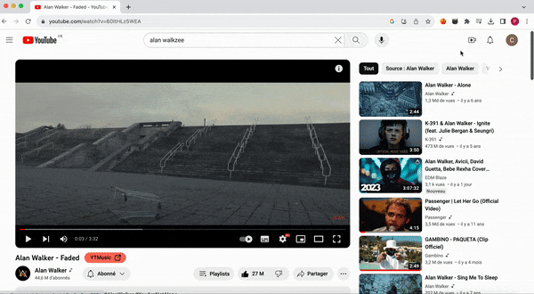
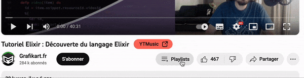
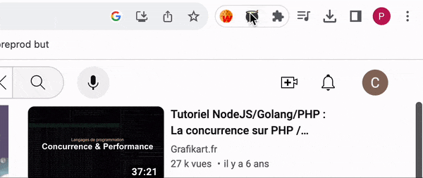

# Chaudrop Chrome extension
This is a Chrome extension that I did for personal use, it adds useful buttons to the Youtube video page.
You can easily download it and add it to browser by loading it as an unpacked extension.

## Find the music (from Youtube Music) associated to a music video
The YTMusic button searches the music title on Youtube Music and redirects to the first title result.
It removes all useless parts like "(Official Music Video)" when doing the search, see `scripts/content.js` for the list of patterns.

## A new playlists button
Sometimes the playlists button doesn't get rendered, this button also allows to access the playlists menu faster, you don't need to click on the three dots.
The playlist button actually works if your youtube page is in french, if you want it to work in another language, change the
`document.querySelector("*[aria-label=\"Enregistrer dans une playlist\"]").click()` line in `scripts/content.js` and put the right `aria-label`.

## Extension Parameters
- Choose whether the button redirects directly to the video or to the Youtube Music search page 
- Display the playlists button or not 
- Choose a playlist where the YTMusic button is rendered (for example a "To Download" playlist), leave the field blank if you want the button to be rendered on every video

